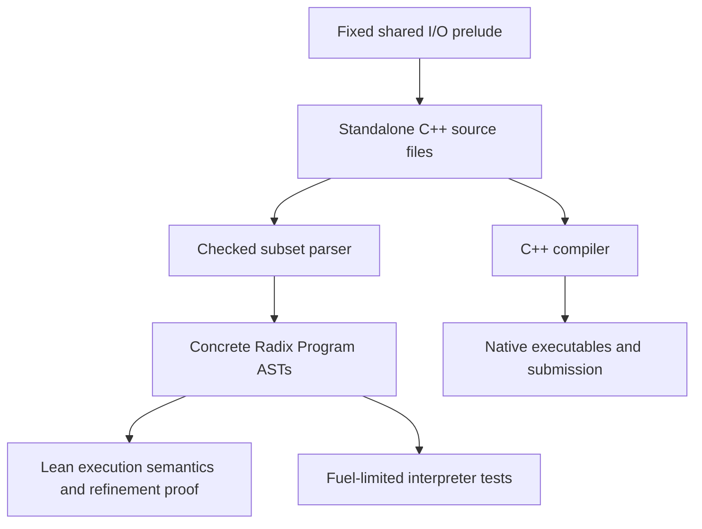

# RStmt: checked C++ programs with Lean refinement proofs

This document describes the implemented design. The original rationale and
implementation milestones remain in [RSTMT_ATCODER_PROPOSAL.md](RSTMT_ATCODER_PROPOSAL.md).

RStmt supports writing a slow executable reference and a faster implementation
as standalone C++ files, then proving that every successful reference execution
is preserved by the optimized program. Lean reasons about programs parsed from
those files. The optimized file itself is the submission artifact.

The initial application is ordinary batch problems with deterministic output.
ABC177 C is the completed example: quadratic pair enumeration is replaced by a
linear running-sum computation.

## 1. Source, semantics, and execution

The architecture has two consumers of the same source files:



The parser checks a deliberately small C++ subset. The logical machine supplies
its meaning, and the interpreter makes that meaning executable for tests.
Native execution relies on the documented correspondence between the subset
semantics, the shared runtime, and C++.

The internal AST remains broader than the submission frontend. It retains
function calls, inliner scopes, and older string operations. Existing
`[RStmt| ...]` quotations remain useful for library tests and slides, but are
not the authoritative source for benchmark proofs.

## 2. The reference specifies both the answer and the accepted input domain

The common theorem is defined in [Radix/Proofs/Refinement.lean](Radix/Proofs/Refinement.lean):

```lean
def Refines (reference optimized : Program) : Prop :=
  ∀ input output,
    RunsSuccessfully reference input output →
    RunsSuccessfully optimized input output
```

`RunsSuccessfully` requires a complete finite `BigStep` execution. It starts
with the program's own function table, an empty local environment and heap,
the supplied input bytes, cursor zero, and empty output. Normal completion or
an ordinary return accepts the entire final output.

There is no problem-specific validity predicate in this interface. Instead,
the reference reads input, checks its requirements, and executes `reject()`
when an input should be excluded.

| Reference behavior | Obligation on the optimized program |
| --- | --- |
| Successfully terminates with output `o` | Successfully terminate with exactly `o` |
| Explicitly rejects | None |
| Encounters a runtime fault | None; this may indicate a reference bug |
| Diverges | None |

This is directional refinement. It compares final output bytes, allowing the
two programs to have different temporary variables or heaps. It does not
require equal execution cost. Exact output equality is intentionally stronger
than a judge that accepts whitespace variations or multiple valid answers.

The reference remains a trusted specification of the problem. A reference that
rejects everything would make refinement vacuous; a reference that prints a
wrong answer would specify that answer. Samples, independent oracles, and
review support reference curation. The refinement theorem itself does not
prove coverage of every official input encoding.

## 3. Execution outcomes and shared state

[PState](Radix/State.lean) contains call frames, a heap, a function table,
immutable input bytes, an input cursor, and accumulated output bytes. The heap
and streams are shared across calls; local variable lookup uses the current
frame.

The relational and executable interfaces distinguish different kinds of
termination:

| Interface | Outcomes |
| --- | --- |
| `BigStep` / `StmtResult` | Normal completion, ordinary return, explicit rejection |
| `Stmt.interp` / `InterpError` | Successful normal/return result, rejection, runtime fault, fuel exhaustion |

Runtime faults have interpreter diagnostics but no successful relational
derivation. An absent rejection derivation therefore does not imply success.
Fuel exhaustion is an inconclusive test result, not semantic rejection or a
proof of divergence. The refinement theorem contains no fuel parameter.

Rejection propagates through sequences, loops, blocks, calls, and the inliner's
internal `scope`. A callee's ordinary return is consumed by its caller; a
callee's rejection terminates the enclosing computation. Error propagation
retains output already produced rather than restoring an earlier stream state.

For example, `write_u64(123ULL); reject();` produces an output prefix but has
no successful execution. Rejection is not identified by empty stdout.

`Program.execute p input fuel` returns both outcome and state, including on
rejection, faults, or fuel exhaustion. `Program.run p fuel input` is the
convenience interface that returns a state only on success.

Determinism, interpreter soundness and completeness, and fuel monotonicity are
proved for the revised semantics. `Stmt.interp_iff_bigStep` covers normal,
returned, and rejected relational results.

## 4. The supported C++ surface

A standalone file consists of the exact shared prelude, one `void solve()`
definition, and this exact entry wrapper:

```cpp
int main() { solve(); return 0; }
```

The prelude defines `u64` as `unsigned long long` and statically checks that it
has 64 value bits. The first frontend accepts:

| Feature | Supported form |
| --- | --- |
| Scalars | Initialized `u64` and `bool` declarations |
| Arrays | One-dimensional `u64*`, zero-initializing `new u64[n]()` |
| Mutation | Scalar assignment and array-element assignment |
| Control flow | Braced blocks, `if`/`else`, `while`, `return;` |
| Pure expressions | Variables, literals, indexing, arithmetic, comparisons, boolean operators |
| Effects | The fixed input, output, EOF, and rejection helpers |

Expressions have a dedicated grammar with C++ precedence and associativity.
Integer literals must be decimal, in range, and suffixed `ULL`; multi-digit
leading-zero source literals are excluded because C++ treats them as octal.
Arithmetic is unsigned modulo `2^64`. Division or remainder by zero faults.
Logical `&&` and `||` short-circuit, including when the skipped operand would
fault. There are no implicit conversions between booleans and integers.

Every source local must be declared and initialized before use. Assignment
cannot introduce a variable or change its type. Lexical scopes resolve names
to unique IDs such as `answer$5`. Inner declarations may shadow outer ones,
and a declaration executes on every entry, including every loop iteration.
The runtime can retain inaccessible bindings in a flat frame because the
subset has no address-taking of locals or observable destructors.

Local names use `[a-z][a-z0-9]*`, excluding reserved keywords and selected
platform macro names. This conservative restriction avoids collisions with
macros exposed by the prelude's headers. Fixed helper spellings are recognized
separately.

The frontend excludes arbitrary user function declarations and calls,
effectful expressions, pointer arithmetic and comparisons, deallocation,
user macros, conditional compilation, exceptions, globals, and unrestricted
standard-library operations. Even familiar C++ spellings such as `++`, `--`,
and unbraced controlled statements are outside this initial grammar.

The checker is in [Radix/Frontend/Cpp.lean](Radix/Frontend/Cpp.lean). These source
restrictions are enforced there; manually constructed internal ASTs do not
automatically acquire the same guarantees.

## 5. Arrays are shared, persistent allocations

An array reference denotes a heap allocation. Copying that reference preserves
its identity, so writes through one alias are visible through another:

```cpp
u64* a = new u64[2ULL]();
u64* b = a;
b[0ULL] = 7ULL;
write_u64(a[0ULL]);
```

There is no ownership or borrowing discipline, no linearity checker, and no
deallocation statement. Allocations remain live after a block or call returns,
or after their last reference is overwritten. The logical heap records array
lengths and checks read/write bounds; source code carries lengths explicitly.

`BigStep.heap_persistent` proves that execution preserves existing allocation
lengths and keeps allocations present, assuming a well-formed initial bump
allocator. Standard initial heaps satisfy this condition. Benchmark proofs
still establish valid indices and reason about aliases.

Persistent allocation makes cumulative memory usage significant. Native arrays
remain allocated until process termination, and logical heap reasoning does
not establish that a program fits a particular machine's memory limit.

## 6. The I/O contract is shared across benchmarks

The logical primitives live in [Radix/Eval/IO.lean](Radix/Eval/IO.lean), with
statement rules and interpreter cases in `Radix/Eval/`. The native adapter is
[runtime/radix_io.hpp](runtime/radix_io.hpp), embedded verbatim in each submission.

| Source operation | Effect |
| --- | --- |
| `read_u64(x);` | Read one unsigned token into a declared scalar |
| `write_u64(e);` | Append canonical unsigned decimal digits |
| `write_text("literal");` | Append the supported literal's bytes |
| `expect_eof();` | Consume remaining whitespace and reject extra input |
| `reject();` | Terminate with explicit rejection |

Whitespace bytes are ASCII 9–13 and 32. Input tokens contain one or more decimal
digits, may have leading zeros, and must represent at most `2^64 - 1`. Signs,
overflow, missing tokens, and nondigit token contents reject. A successful read
consumes the first trailing whitespace byte, if present; EOF immediately after
the last digit is allowed. EOF is distinct from every byte value.

The unsigned printer has no leading zeros except for zero itself. Spaces and
newlines are explicit literal writes. Supported literals contain printable
ASCII with the escapes `\n`, `\r`, `\t`, `\\`, and `\"`.

I/O occurs only in statements. The native adapter uses fixed byte rules rather
than locale-dependent stream extraction, and `reject()` uses
`std::exit(EXIT_FAILURE)`. Output before rejection can be flushed normally;
there is no transactional output buffer. Interactive timing is outside the model.

## 7. Exact source binding and build dependencies

[Radix/Benchmarks/ABC177C.lean](Radix/Benchmarks/ABC177C.lean) uses two elaborators:

- `cpp_file%` embeds the standalone file's contents as a Lean string.
- `cpp_program%` runs the checked parser and emits a concrete, transparent AST
  that subsequent proofs can manipulate efficiently.

The emitted AST is tied to the embedded source by explicit equations:

```lean
reference_parses : parseSubmission referenceSource = .ok reference
optimized_parses : parseSubmission optimizedSource = .ok optimized
```

`source_certificate` packages these equations together with
`Refines reference optimized`. There is no separately handwritten submission
translation or alternate algorithm selected with preprocessor flags.

[lakefile.lean](lakefile.lean) declares the header and both C++ files as binary
`input_file` dependencies and attaches them to Radix with `needs`. Byte changes
therefore invalidate cached proof artifacts. Changing the prelude without
updating its embedded copies fails parsing. Header and source mutation tests
have verified that this invalidation actually occurs.

## 8. How the ABC177 C proof is assembled

Both programs read `n`, reject values outside `[2, 200000]`, allocate one array,
read and validate every element against `10^9`, check EOF, and initialize the
modulus and answer. This common prefix is part of the parsed source and proof.

The reference enumerates all `i < j` pairs. The optimized loop maintains:

```text
running = sum of preceding elements modulo M
answer  = sum of products of preceding pairs modulo M
M       = 1000000007
```

For each new element, it adds `running * a[j]` to the answer before adding
`a[j]` to `running`, excluding the self-pair. Both implementations write the
decimal answer and a newline.

The proof is divided into reusable facts and concrete execution proofs:

| Module | Responsibility |
| --- | --- |
| [InputFacts](Radix/Benchmarks/InputFacts.lean) | Bounds on array cells and successful validation guards |
| [InputValidation](Radix/Benchmarks/InputValidation.lean) | Extract validated array facts from the actual shared prefix |
| [PairSum](Radix/Benchmarks/PairSum.lean) | Pair-sum algebra, modular scans, and unsigned arithmetic bounds |
| [ReferenceLoop](Radix/Benchmarks/ReferenceLoop.lean) | Construct finite executions of the actual reference inner/outer loops and output suffix |
| [OptimizedLoop](Radix/Benchmarks/OptimizedLoop.lean) | Construct finite executions of the actual running-sum loop and output suffix |
| [ABC177CRefinement](Radix/Benchmarks/ABC177CRefinement.lean) | Compose prefix, computations, determinism, and exact output equality |

The final proof starts from an arbitrary successful reference execution,
extracts the shared prefix, and obtains its validated array. It constructs both
computation suffixes over that array, relates their answers to the same
mathematical pair sum, and uses determinism to identify the constructed
reference result with the supplied execution. It then constructs the complete
optimized run. Different temporary locals do not need to be equal.

The arithmetic proofs establish that the multiply-add operations fit below
`2^64` before reduction modulo `M`. Both loop proofs include termination and
array-index bounds. Optimized termination is a conclusion, not an extra premise.

The five existing optimizer passes also remain available with correctness
proofs: constant folding, dead-code elimination, copy propagation, constant
propagation, and inlining. Their revised rules preserve I/O and rejection and
respect short-circuit evaluation. The quadratic-to-linear benchmark change is
proved separately; it is not a new automatic optimizer pass.

## 9. What is proved and what is trusted

The whole-program theorem `Radix.Benchmarks.ABC177C.refinement` is kernel-checked
and depends only on Lean's standard `propext`, `Classical.choice`, and
`Quot.sound` axioms. No axiom assumes the algorithmic optimization is correct.

Concrete parsing equations currently use `native_decide`, which introduces
generated per-certificate axioms trusting compiled Lean evaluation. The combined
`source_certificate` therefore has those dependencies as well. The standalone
algorithmic refinement theorem does not depend on them.

Two further shared assumptions connect this result to a native submission:

1. The checked parser and its lowering agree with C++ meaning for accepted source.
2. The native runtime implements the logical I/O contract.

There is no independent C++ target semantics or verified compiler simulation.
Native execution also assumes appropriate compiler, library, allocator, OS,
hardware, resources, and byte transport. Local runtime measurements are tests,
not cost theorems or AtCoder verdicts.

## 10. Working with the design

To reproduce the current source-and-proof result:

```sh
lake build Radix
lake build
python3 scripts/check_abc177c.py --report benchmarks/abc177c/local-results.json
```

The script builds proofs and slides, prints axiom dependencies, compiles the
standalone sources, tests samples and malformed inputs, compares randomized and
boundary cases with an independent exact-integer oracle, and measures the
maximum-size runtime gap. It also compiles snippets extracted from the Lean
frontend regression tests. Source/prelude hashes and platform details are
recorded in the report.

For a future benchmark, the same process is: write a validating reference and
optimized standalone source; embed and parse those files; derive useful state
facts from their executable validation; prove the actual computation loops;
compose the complete `Refines` theorem; then run native checks and audit the
source certificate. The theorem interface stays the same, while invariants and
algorithmic mathematics remain benchmark-specific.

Signed input, general runtime strings in the frontend, arbitrary user
functions, multiple-answer acceptance relations, interactive protocols, and
verified native compilation are outside the current submission language.
